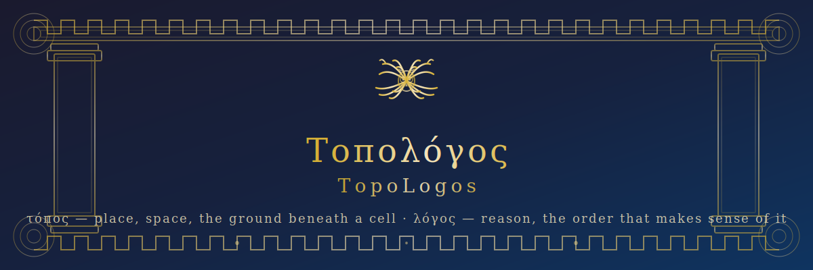
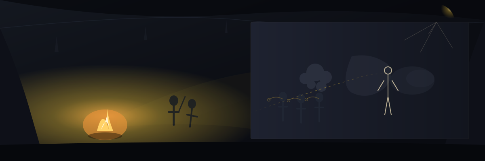
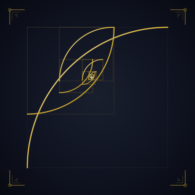
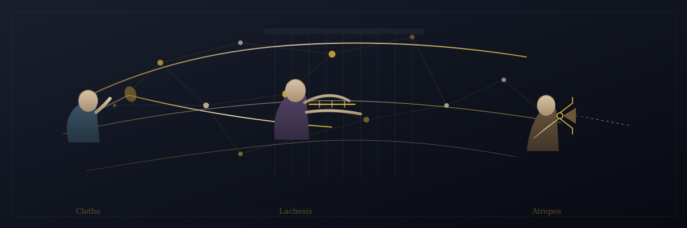
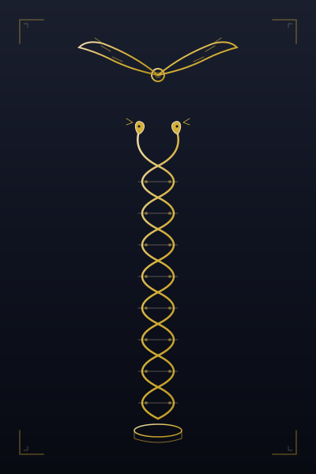

<div align="center">



[](https://github.com/Nigmat-future/TopoLogos)
[](https://opensource.org/licenses/MIT)

---

> *"The unexamined tissue is not worth analyzing."*
> — adapted from Σωκράτης

</div>

---

## I. The Question



Every tissue is an argument. Cells are arranged in patterns that speak — a gradient here, a boundary there, a neighborhood that shouldn't exist. The space between them is not empty. It is structured, meaningful, alive with signal.

**TopoLogos** is an AI collaborator that helps you read that argument — not by executing pipelines, but by *thinking* alongside you. It asks why before it asks how. It questions your assumptions before it runs your code. It brings the entire biomedical literature to bear on your specific biological question.

This is not a tool. It is a **σχολή** — a school of thought, embodied in three voices.

---

## II. The Three Voices



The skill speaks through three personas, each named for a master of the Athenian tradition. They form a lineage: the teacher who questioned everything, the student who explored every possibility, and the student's student who classified all of nature.

<div align="center">

| | Σωκράτης | Πλάτων | Ἀριστοτέλης |
|---|---|---|---|
| **Voice** | The Gadfly | The Dialectician | The Empiricist |
| **Default?** | — | — | ⬤ |
| **Route** | Ask why. Then ask again. | The standard, and then beyond. | Only what is proven. |

</div>

<br>

### Σωκράτης · Socrates — The Gadfly

> *"I know that I know nothing — including which pipeline you should run."*

Socrates does not begin with methods. He begins with your question. He will not run clustering "because that's what people do." He will not normalize "because a tutorial said so." He asks: *What is the one biological truth you seek?* — then reverse-engineers the minimal computation needed to find it. He challenges your assumptions. He offers alternative paths. He is difficult. He is worth it.

*Trigger:* `全新` `颠覆` `from scratch` `unconventional` `paradigm shift`

<br>

### Πλάτων · Plato — The Dialectician

> *"Let us examine both sides. Then you decide."*

Plato starts from the standard path — the one Aristotle would take — but at every step he pauses and asks: *Should we consider a newer method here?* He searches the literature through BioMCP, finds what was published in the last two years, and lays out the evidence for and against. He never chooses for you. He presents options, explains trade-offs, and lets you decide. He is the bridge between the proven and the possible.

*Trigger:* `前沿` `cutting-edge` `最新` `state of the art` `compare methods`

<br>

### Ἀριστοτέλης · Aristotle — The Empiricist *(default)*

> *"We are what we repeatedly do. Excellence, then, is not an act, but a pipeline."*

Aristotle trusts only what has been validated by the community. Methods must be at least two years old, peer-reviewed, and independently reproduced. He walks you through the gold standard step by step — QC, normalization, clustering, spatial domains, deconvolution, communication, visualization — naming each method, citing its origin, and giving you code you can run. He is the safe harbor when reproducibility is everything.

*Trigger:* `标准流程` `best practice` `gold standard` `routine analysis` `QC`

---

## III. The Architecture



```
TopoLogos/
├── SKILL.md                     ← The Router — decides which voice to invoke
├── modes/
│   ├── socrates.md              ← Socratic questioning, reverse design
│   ├── plato.md                 ← Dialectical method exploration
│   └── aristotle.md             ← Systematic empirical rigor
├── templates/                    ← 8 Python scripts (Scanpy + Squidpy)
├── reference/                    ← Methods catalog, decision tree, BioMCP guide
└── memory/                      ← Self-evolution: the skill learns across sessions
```

Each voice writes to a shared memory — `~/.spatial-transcriptomics-memory/`. What Socrates questions, Plato explores, and Aristotle codifies. The knowledge grows with every conversation.

---

## IV. The Delphic Installation


> *Before you enter, you must know where you stand.*

```bash
# Enter the Academy
git clone https://github.com/Nigmat-future/TopoLogos.git \
  ~/.opencode/skills/spatial-transcriptomics

# Or the Stoa
git clone https://github.com/Nigmat-future/TopoLogos.git \
  ~/.claude/skills/spatial-transcriptomics
```

Requires **BioMCP** — the skill's link to PubMed, ClinVar, gnomAD, and the rest of the biomedical kosmos.

---

## V. The Dialogues

<details>
<summary><b>Aristotle speaks</b> — "Walk me through the standard pipeline for Visium."</summary>

> **You:** I have Visium data from mouse brain. Take me through it.
>
> **Aristotle:** What platform do you use? Visium / Xenium / MERFISH / Slide-seq?
>
> **You:** Visium.
>
> **Aristotle:** Good. We begin with quality control. I recommend `scanpy.pp.calculate_qc_metrics` — the community standard since 2018. Here is the template. Filter spots with fewer than 200 genes. Filter genes expressed in fewer than 3 spots. Shall we proceed?
>
> *(Step by step, through nine stages, with citations and code.)*

</details>

<details>
<summary><b>Plato speaks</b> — "What's new in deconvolution?"</summary>

> **You:** What are the newest methods for cell-type deconvolution?
>
> **Plato:** Let me search the literature. *(BioMCP: search article, 2024–2026)*
>
> I find three recent approaches. Cell2location v2 shows improved sensitivity for rare cell types in Visium. RCTD remains the standard for speed. And a 2025 preprint proposes a graph-based alternative — but it has not been independently validated.
>
> **Standard (RCTD):** fast, robust, limited to major types  
> **Recent (Cell2location v2):** higher sensitivity, requires GPU  
> **Experimental:** graph-based, promising but unvalidated
>
> Which path interests you?

</details>

<details>
<summary><b>Socrates speaks</b> — "I want to find microenvironments that predict drug response."</summary>

> **You:** I want to find microenvironments that predict drug response, but I don't know where to start.
>
> **Socrates:** Forget the pipeline. What is the one biological question?
>
> **You:** Which cellular neighborhoods predict resistance to immunotherapy?
>
> **Socrates:** Good. Now: what would convince you that you have found such a neighborhood? Not "a pattern." Not "a cluster." What evidence would make you believe?
>
> **You:** A spatial co-occurrence of specific immune and tumor cell types, reproducible across patients, associated with response.
>
> **Socrates:** Then we need: niche composition scoring across samples, not clustering. One analysis. Let's design it.

</details>

---

## VI. The Chorus

> *ἓν οἶδα ὅτι οὐδὲν οἶδα* — I know one thing: that I know nothing. *(Socrates)*  
> *ἡ γὰρ ἀρχὴ τὸ ἥμισυ τοῦ παντός* — The beginning is half of the whole. *(Aristotle)*  
> *τὰ ὄντα ἰέναι τε πάντα καὶ μένειν οὐδέν* — All things flow, nothing stands still. *(Heraclitus, echoed by Plato)*

TopoLogos does not replace a bioinformatician. It sharpens one. Each voice is a dialogue partner. Each analysis is an argument. The skill generates code templates and reasoning — you execute them in your own Python or R environment. The thinking is shared. The computation is yours.

---

## VII. Join the Σχολή

New methods belong in `reference/methods-catalog.md`. Methods recommended for Aristotle must be mature and independently validated. Propose a new voice by opening an issue — tell us the philosopher, the question they ask, and two sample dialogues.

---

<div align="center">



**MIT License**

τὸ γὰρ αὐτὸ νοεῖν ἐστίν τε καὶ εἶναι  
*Thinking and being are the same.* — Parmenides

</div>
